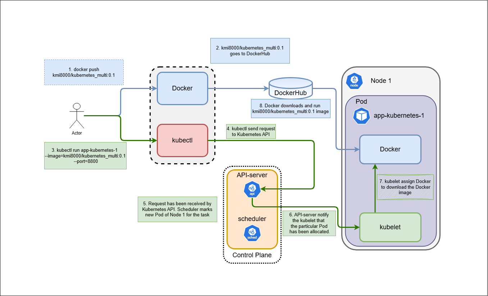

# 7. Creating a Pod. Launching Containers in Kubernetes.

Deploy the cluster by `minikube.exe start --driver vmware`

Deploy Kubernetes_multi:0.1 image on cluster, expose the port 8000

`kubectl run app-kubernetes-1 --image=kmi8000/kubernetes_multi:0.1 --port=8000`

The whole process of providing docker image to the kubernetes cluster.

<p align="center">
  
</p>



Check the Pod was allocated to the docker image by `kubectl.exe get pods`.
The output shows the Pod and its status.

```
NAME               READY   STATUS    RESTARTS   AGE
app-kubernetes-1   1/1     Running   0          161m
```

For more detailed information about the Pod the command `kubectl describe pod app-kubernetes-1` can be issued.

Output

```
Name:             app-kubernetes-1                                                                                                                                     Namespace:        default                                                                                                                                              Priority:         0                                                                                                                                                    Service Account:  default                                                                                                                                              Node:             minikube/192.168.16.132                                                                                                                              Start Time:       Tue, 11 Feb 2025 21:24:29 +0200                                                                                                                      Labels:           run=app-kubernetes-1                                                                                                                                 Annotations:      <none>                                                                                                                                               Status:           Running                                                                                                                                              IP:               10.244.0.14                                                                                                                                          IPs:                                                                                                                                                                     IP:  10.244.0.14                                                                                                                                                     Containers:                                                                                                                                                              app-kubernetes-1:                                                                                                                                                        Container ID:   docker://c569f4f4e7c9b7450e02572d9f30291d7af6a5ca149949dbeb6bada0d0b2a92d                                                                              Image:          kmi8000/kubernetes_multi:0.1                                                                                                                           Image ID:       docker-pullable://kmi8000/kubernetes_multi@sha256:d88da6fb7b400bac387d85768304ef31b0cdac052852f70ec6acbf4a00b62bdf                                     Port:           8000/TCP                                                                                                                                               Host Port:      0/TCP                                                                                                                                                  State:          Running                                                                                                                                                  Started:      Tue, 11 Feb 2025 21:24:59 +0200                                                                                                                        Ready:          True                                                                                                                                                   Restart Count:  0                                                                                                                                                      Environment:    <none>                                                                                                                                                 Mounts:                                                                                                                                                                  /var/run/secrets/kubernetes.io/serviceaccount from kube-api-access-6z4z9 (ro)                                                                                    Conditions:                                                                                                                                                              Type                        Status                                                                                                                                     PodReadyToStartContainers   True                                                                                                                                       Initialized                 True                                                                                                                                       Ready                       True                                                                                                                                       ContainersReady             True                                                                                                                                       PodScheduled                True                                                                                                                                     Volumes:                                                                                                                                                                 kube-api-access-6z4z9:                                                                                                                                                   Type:                    Projected (a volume that contains injected data from multiple sources)                                                                        TokenExpirationSeconds:  3607                                                                                                                                          ConfigMapName:           kube-root-ca.crt                                                                                                                              ConfigMapOptional:       <nil>                                                                                                                                         DownwardAPI:             true
QoS Class:                   BestEffort                                                                                                                                Node-Selectors:              <none>                                                                                                                                    Tolerations:                 node.kubernetes.io/not-ready:NoExecute op=Exists for 300s
                             node.kubernetes.io/unreachable:NoExecute op=Exists for 300s
Events:                      <none>  

```

To check what is inside or the app-kubernetes-1 container the exec command can be used.

For example

```
H:\k8s\> kubectl exec -it app-kubernetes-1 -- /bin/bash
root@app-kubernetes-1:/# ls -la                                                                                                                                        total 80                                                                                                                                                               drwxr-xr-x   1 root root 4096 Feb 11 19:24 .                                                                                                                           drwxr-xr-x   1 root root 4096 Feb 11 19:24 ..                                                                                                                          -rwxr-xr-x   1 root root    0 Feb 11 19:24 .dockerenv                                                                                                                  drwxr-xr-x   1 root root 4096 Sep 10  2020 bin                                                                                                                         drwxr-xr-x   2 root root 4096 Jul 10  2020 boot                                                                                                                        drwxr-xr-x   5 root root  360 Feb 11 19:24 dev                                                                                                                         drwxr-xr-x   1 root root 4096 Feb 11 19:24 etc                                                                                                                         drwxr-xr-x   2 root root 4096 Jul 10  2020 home                                                                                                                        drwxr-xr-x   1 root root 4096 Sep 10  2020 lib                                                                                                                         drwxr-xr-x   2 root root 4096 Sep  8  2020 lib64                                                                                                                       drwxr-xr-x   2 root root 4096 Sep  8  2020 media                                                                                                                       drwxr-xr-x   2 root root 4096 Sep  8  2020 mnt                                                                                                                         drwxr-xr-x   2 root root 4096 Sep  8  2020 opt                                                                                                                         dr-xr-xr-x 262 root root    0 Feb 11 19:24 proc                                                                                                                        drwx------   1 root root 4096 Sep 10  2020 root                                                                                                                        drwxr-xr-x   1 root root 4096 Feb 11 19:24 run                                                                                                                         drwxr-xr-x   1 root root 4096 Sep 10  2020 sbin                                                                                                                        -rwxr-xr-x   1 root root  472 Feb 11 18:29 server.py                                                                                                                   drwxr-xr-x   2 root root 4096 Sep  8  2020 srv                                                                                                                         dr-xr-xr-x  12 root root    0 Feb 11 19:24 sys                                                                                                                         drwxrwxrwt   1 root root 4096 Sep 10  2020 tmp                                                                                                                         drwxr-xr-x   1 root root 4096 Sep  8  2020 usr                                                                                                                         drwxr-xr-x   1 root root 4096 Sep  8  2020 var                                                                                                                         root@app-kubernetes-1:/# cat server.py                                                                                                                                 from http.server import HTTPServer, BaseHTTPRequestHandler                                                                                                             import socket
class SimpleHTTPRequestHandler(BaseHTTPRequestHandler):
    def do_GET(self):
        self.send_response(200)
        self.end_headers()
        self.wfile.write(b'Hello world from hostname: ' + socket.gethostname().encode())
                                                                                                                                                                         SERVER_PORT = 8000
httpd = HTTPServer(('0.0.0.0', SERVER_PORT),
SimpleHTTPRequestHandler)
print('Listening on port %s ...' % SERVER_PORT)
httpd.serve_forever()root@app-kubernetes-1:/#
```

Instead of using CLI commands, the YAML file can be used to deploy a Docker image. The YAML file works as an insctruction, what to deploy, what name, what workspace etc.

The following code is the example of such YAML file.

```
apiVersion: v1
kind: Pod
metadata:
  name: app-kubernetes-2
spec:
  containers:
  - name: app-kubernetes-2-container-2
    image: kmi8000/kubernetes_multi:0.1
    ports:
    - containerPort: 8000
```

To get more detailed information about the pod, issue the command ` kubectl.exe get pod app-kubernetes-2 -o yaml`.

To communicate with deployed containers the port-forwarding must be used.

To enable port-forwarding with CLI apply command `kubectl port-forward app-kubernetes-1 11111:8000` for app-kubernetes-1, and accordingly `kubectl port-forward app-kubernetes-2 22222:8000` for app-kubernetes-2. To check the connection open localhost:11111 and localhost:22222 by web browser.

The output of app-kubernetes-2 container shows the server name `Hello world from hostname: app-kubernetes-2`.

To see minimal logs of containers apply `kubectl logs app-kubernetes-1` or `kubectl logs app-kubernetes-2`.

The output shows the last logs

```
Listening on port 8000 ...
127.0.0.1 - - [11/Feb/2025 23:42:48] "GET / HTTP/1.1" 200 -
127.0.0.1 - - [11/Feb/2025 23:42:49] "GET /favicon.ico HTTP/1.1" 200 - 
127.0.0.1 - - [11/Feb/2025 23:45:40] "GET / HTTP/1.1" 200 - 
127.0.0.1 - - [11/Feb/2025 23:45:41] "GET /favicon.ico HTTP/1.1" 200 - 
127.0.0.1 - - [11/Feb/2025 23:54:16] "GET / HTTP/1.1" 200 - 
127.0.0.1 - - [11/Feb/2025 23:54:16] "GET /favicon.ico HTTP/1.1" 200 -
```

In case of removing the container, the logs are also will be deleted. To avoid that, the external logs storage can be connected.

